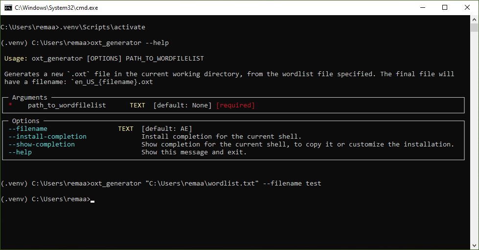

<!--- Heading --->
<div align="center">
  
  <p>
    Generates `.oxt` file for openoffice extensions and PDFxchange spellchecks
  </p>
<h4>
    <a href="assets/screenshot.png">View Demo</a>
  <span> · </span>
    <a href="https://github.com/rpakishore/oxt-custom_dict">Documentation</a>
  <span> · </span>
    <a href="https://github.com/rpakishore/oxt-custom_dict/issues/">Report Bug</a>
  <span> · </span>
    <a href="https://github.com/rpakishore/oxt-custom_dict/issues/">Request Feature</a>
  </h4>
</div>
<br />


<!-- Table of Contents -->
<h2>Table of Contents</h2>

- [1. About the Project](#1-about-the-project)
  - [1.1. Screenshots](#11-screenshots)
  - [1.2. Features](#12-features)
- [2. Getting Started](#2-getting-started)
  - [2.1. Dependencies](#21-dependencies)
  - [2.2. Installation](#22-installation)
- [3. Usage](#3-usage)
- [Roadmap](#roadmap)
- [4. License](#4-license)
- [5. Contact](#5-contact)
- [6. Acknowledgements](#6-acknowledgements)

<!-- About the Project -->
## 1. About the Project
<!-- Screenshots -->
### 1.1. Screenshots

<div align="center"> 
  
</div>

<!-- Features -->
### 1.2. Features

- Generate `.oxt` files for use with openoffice or PDFxchange.
- Checks the wordlist for compatibility with popular extensions

<!-- Getting Started -->
## 2. Getting Started

### 2.1. Dependencies

The package comes pre-compiled with all the required dependencies, no external dependency will be needed.

<!-- Installation -->
### 2.2. Installation

Create a virtual env and Install from pypi

```bash
python -m venv .venv

.venv\Sripts\activate

pip install oxt_generator
```
<!-- Usage -->
## 3. Usage

Activate the virtual environment and call `oxt_generator`

```bash
.venv\Scripts\activate

oxt_generator --help
```

To create a new oxt file

```bash
oxt_generator <"Path\to\wordlist.txt"> --filename <custom_filename>
```

where,

- `Path\to\wordlist.txt` refers to the file location of the wordlist to be added
- `custom_filename` refers to the filename for the oxt file. The final file will be named `en_US_custom_filename.oxt`

## Roadmap

- [ ] Pending Tests

<!-- License -->
## 4. License

See LICENSE.txt for more information.

<!-- Contact -->
## 5. Contact

Arun Kishore - [@rpakishore](mailto:pypi@rpakishore.co.in)

Project Link: [https://github.com/rpakishore/oxt-custom_dict](https://github.com/rpakishore/oxt-custom_dict/)

<!-- Acknowledgments -->
## 6. Acknowledgements

Use this section to mention useful resources and libraries that you have used in your projects.

- [Awesome README Template](https://github.com/Louis3797/awesome-readme-template/blob/main/README-WITHOUT-EMOJI.md)
- [Banner Maker](https://banner.godori.dev/)
- [Shields.io](https://shields.io/)
